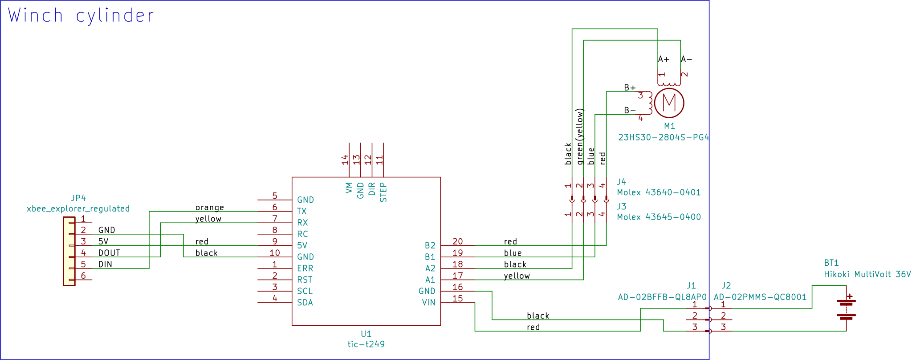

= Wireless echosounder calibration winch manual
:author: Gavin Macaulay, Aqualyd Limited
:email: gavin@aqualyd.nz
:revnumber: v1.0
:revdata: June 2021
:revremark: First draft
:sectnums:
:doctype: book
:toc:
:toclevels: 4
:xrefstyle: short
:imagesdir: ../.

= User Manual

== Supply of power

The winch units each require a 36 V DC power supply. These are used supplied. The winch units have a water-resistant bulkhead connector for supply of the power and a matching cable connector is provided for each winch. It is the user's responsibility to source and connect suitable 36 V DC power supplies to each winch. Pin 1 in the connector should be connected to the positive of the DC supply and pin 3 to the negative of the DC supply (there is no pin 2) (see, <<winch_schematic>>). The supplied connector can accomodate a cable with external diameter between 4 and 8 mm. 

Normal operation current is XX A. To ensure voltage stability during winch operations, the power supply system should be capable of supplying YY A.

The winches will operate with an input voltage between 10 and 40 V, but require about 36 V to hold the rated load. Exceeding 40 V will damage the winch electronics. 

== Installing the winches and poles

The system is assembled by:

1. Inserting a telescopic pole into the yellow tube on each winch unit. 
2. Aligning the holes in the yellow tube and pole and inserting the locking pin (the pole will extend about 200 mm inboard from the yellow tube)
3. Lead the winch line through the eye-bolt on the outboard end of the pole
4. Attach the supplied eye-bolts to the onboard end of the poles 
5. Attachg a tie-down cord to each eye-bolt using the attached carabiner
6. Secure the assembled units to the vessel
7. Connect power (uyser supplied) to each winch

NOTE: Line should be added to the reel so that the free end leaves from the underneath of the drum when viewing the unit with the yellow tube to your right.

The winch units are designed to attach to a railing or to a flat plate (FIG). A railing attachment uses the supplied hose clamps to secure the aluminium section of the winch unit to the railing. A flat plate attachement uses clamps (user supplied) to secure the winch units' base or the aluminium section to the flat plate. The leverage from the extended poles is countered by the cord attachment from the inner end of the pole to suitable points on the vessel (e.g., a lower railing or gusset)

Each winch is numbered - place the winches in a location that fits with the layout of the numbered switches on the hand controller (FIG). For example, if one pole is at the bow of the vessel and the other two poles on port and starboard side, place winch 1 at the bow, winch 2 to port and winch 3 to starboard. Note that winch 1 is designed to hold the long telescopic pole.

WARNING: When extending the telescopic poles do not extend each section beyond the red band and ensure each pole clip is closed after extending.

NOTE: The winches will rotate relatively freely until power is applied to the winches, after which the only way to rotate the winches is by using the hand controller.

The hand controller, range extender, and winches automatically form a wireless mesh network that relays commands from the hand controller to all winches even if not all winches can be reached directly from the hand controller. The range extender can be used to bridge any gaps in this network. 

== Usage

Individual winches can be controlled using the three in/out switches on the hand controller. The speed of the winches is controlled using the dial. The slowest speed is about 20 mm/s and the fastest about 1 m/s. Multiple winches can be operated at the same time.

WARNING: Only use speeds in the red section of the dial when the weight on individual winches is less than 3 kg.

The in/out switches are configured to pay out line when the inner side of the switch is pressed. In that sense, the arrow on the switches indicates the direction that the sphere will move when viewed in a split-beam echosounder sphere position plot.

To make it easy to relate the three winch switches to the winch locations, rotate the hand controller so that the winch switches approximately match the locations of the winches on the vessel when facing towards the bow. This will often mean holding the winch controller in a landscape orientation (see Figure).

== Charging the batteries 

The hand controller and range extender contain rechargable batteries. To charge these, connect the supplied USB cable to the unit and to a USB power supply (the USB port on a computer is fine) and _turn the unit on_. 

Charging a completely flat battery will take about 4 hours - no harm will occur to the battery if it is connected to the charger for longer than this. A fully charged battery will power a unit for about 40 hours.

Note that the unit will be operating and transmitting whenever USB power is suppled, but will not charge the battery until the power switch is turned on (the on/off switch connects or disconnects the battery from the system - it does not affect any power supplied through the USB cable).

No external indication is given as to whether the battery is being charged (there is an internal LED that shows the charging state).

WARNING: Charging will only occur when the on/off switch on the hand controller or range extender is in the on position.

== Operation

The hand controller broadcasts a short message that contains the state that each winch should be in (speed and direction). Each winch selects out the data intended for itself based on its' identification number (1, 2, 3). Two complete calibration sets have been provided to CSIRO and this broadcast design allows for swapping of units between the two sets - it does not matter which hand controller or winch is used. 

Using two hand controllers at the same time is currently not recommended as each controller is continually broadcasting messages. However, multiple winches with the same identification can be used at the same time - they will operate in sync (although whether this is a useful thing to do, I don't know!). 

If the hand controller messages do not reach a winch (through a flat battery, being turned off, or the signal being blocked by objects) the winch will continue with the last command for 0.5 seconds before stopping. When the hand controller messages start being received by the winch again, the winch will follow those new messages.

The winches will free-wheel as long as no power is applied to the winches. When power is applied, the winch will follow the messages from the hand controller, or if none are being received, the winch will not rotate.

There is currently no communication from the winches back to the hand controller.

== Routine maintenance

After each use:

- charge the batteries in the hand controller and range extender.
- gently wash down the winches and poles in freshwater
- separate out the telescopic parts of the poles and allow any internal water to dry before reassembling

=== Supplied Parts
A wireless system consists of the following components:

[cols="1,1"]
|===
|Component|Quantity

|Transit/storage case (Nanuk 960)
|1

|Case foam (lower tray)
|1

|Case foam (upper tray)
|1

|Winch unit (short pole)
|2

|Winch unit (long pole)
|1

|Hand controller
|1

|Range extender
|1

|Short pole
|2

|Long pole
|1

|Pole attachment cord
|3

|Pole attachment eyebolt
|3

|Power supply connector
|3

|Power supply connector cover
|3

|Winch power socket cover
|3

|Charging cord (USB)
|1

|User & Technical manual
|1

|Hose clamps (46-70 mm diameter)
|6

|G-clamps (not supplied)
|6

|===

= Technical Manual

== System description

The overall system consists of a hand controller and three winches. Communication between these units occurs via a 2.4 GHz mesh network, provided by Digi Xbee3 radio modules. Switch and potentiometer settings on the hand controller are broadcast to the winch units which then control the speed and direction of the winch motors. The motors are type XXX, driven by a XXX controller. This controller is driven using the STEP/DIR output from a Pololu motor controller which in turn is controlled via serial commands from a microPython programm running in the XBee3 radio module in each winch unit.

The winch units operate with a 10-40 V DC input, but 36 V is needed to achieve sufficient motor torque to hold the design line tension. 

The hand controller broadcasts a message at 5 Hz to all listening units and contains the state of all three in/out switches and the potentiometer. Each winch unit listens to these messages, picks out the relevant in/out switch state and sends speed and direction commands to the motor controller. The relationship between the speed setting on the hand controller and the actual motor speed is determined by calculations done by the code running in the winch unit. The acceleration and decceleration applied when the motor speed is changed is determined by a programmable setting in the motor controller. A programmable maximum motor speed is enforced by the motor controller, as is the timeout duration when no hand controller messages are received.

TABLE
Acceleration/decceleration: 0.5 s from full speed to stop and stop to full speed
Maximum speed: 1.0 m/s
Timeout duration: 0.5 s

=== Winches

The winches consist of XXX

=== Poles

The poles are telescopic and made of a 50/50 mix of carbon fibre and fibreglass.

The poles are originally made for window washing and are readily available from many cleaning supplies sources.

== Changing winch identification

Changing the winch identification may be necessary when replacing a faulty winch. 

Each winch has an identification number (1, 2, 3). This is used by each winch to select the appropriate part of the message sent by the hand controller. This number is stored in each winch as a programmable parameter in the Xbee3 unit (the NI parameter) and read when powering up. Changing this number can be done using the Digi XCTU software (via USB) or the Digi XBee mobile app (via Bluetooth). 

Note that the hand controller only sends out messages to winches with identification codes of 1, 2, or 3. If the winch NI parameter is set to any other value that winch will not act on any commands from the hand controller.

== Assembling/disassembling the winch unit

=== Access to electronics

=== Removing the drum and bearings

== Software

The hand controller runs microPython software on the enclosed Xbee3 module to translate buttons presses and speed setting into the message that is broadcast to the winches. The Xbee 3 in each winch receives these messages, decodes them and sends motor speed and direction commands to the motor controller.

The code that runs on these Xbee3 modules is available on github: URL.

Uploading the microPython code to the Xbee3 module in the hand controller is done via the USB connector on the hand controller. Uploading to the Xbee3 module in the winches requires a separate board that provides serial access to the Xbee3 (e.g., XXX). Modifying the parameters in the Pololu motor controller can be done via the USB connector on the Pololu unit. Modifying the sub-step settings on the XXX motor controller is done via DIP switches on the speed controller itself.

The range extender also includes an xbee3, but the routing of messages is handled by the Xbee3 itself, rather than via a microPython program.

[appendix]

== Schematics

.Wiring schematic for the winch unit.
[[winch_schematic]]

