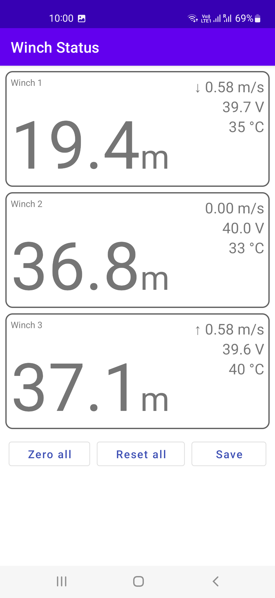
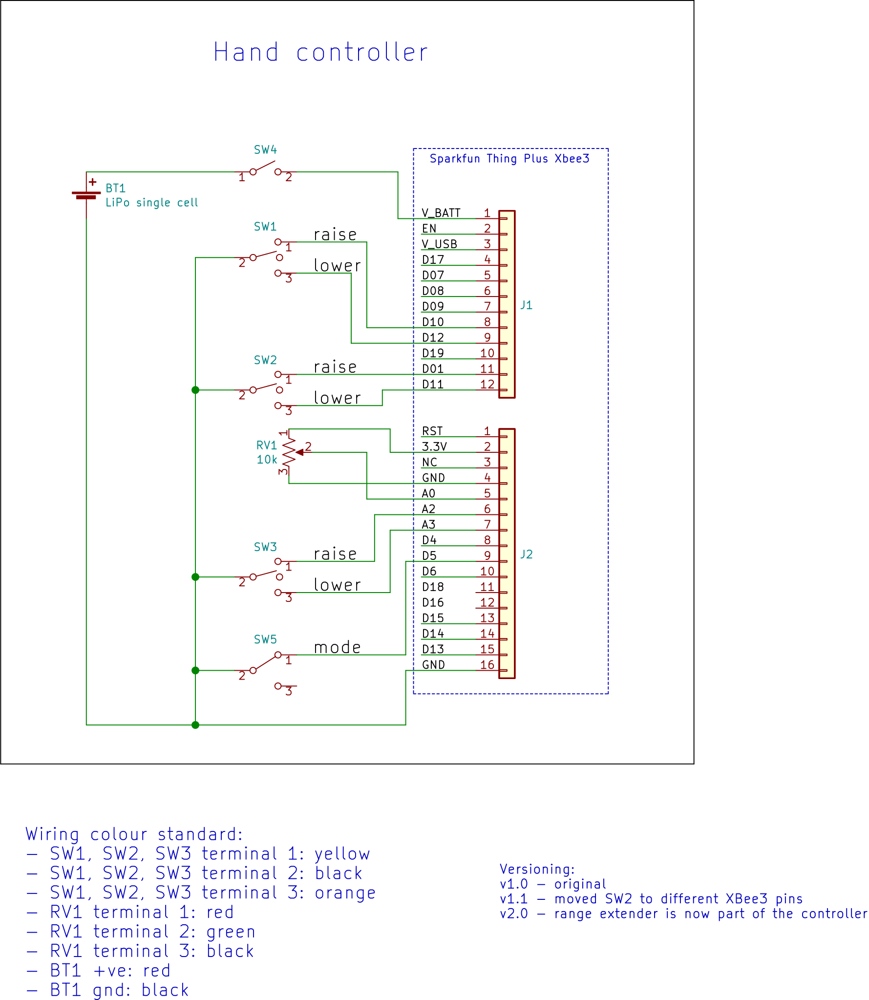

= Wireless echosounder calibration winch manual
:author: Aqualyd Limited
:email: gavin@aqualyd.nz
:revnumber: 1.3
:revdata: June 2024
:sectnums!:
:doctype: book
:toc:
:toclevels: 4
:xrefstyle: short
:imagesdir: .
:chapter-label:
:hide-uri-scheme:

[colophon]

(C) 2022 Aqualyd Limited +
341 Higgins Road +
Wakefield +
New Zealand

https://www.aqualyd.nz

The latest vesion of this manual is available on https://github.com/gavinmacaulay/wireless-winches.git[github].

= User Manual

This is the User Manual for the Aqualyd wireless echosounder calibration winch system and provides information on setting up and using the system.

== First-use setup

=== Supply of power

The winch units each require a Hikoki MultiVolt 36 V DC battery. Four of these batteries are provided and one charger,so that a spare battery is always available and can be charging while using the system.

=== Installation of line on the reels

Line should be added to the reels so that the free end leaves from underneath the drum (and away from you) when viewing the unit with the yellow tube to your right. If the direction of the winches does not match the arrows on the hand controller, it is most likely that the line has been wound on the wrong way.

== Operating the system

=== Installing the winches and poles

Each winch/pole unit is assembled by:

1. Inserting a telescopic pole into the yellow tube on each winch unit (orient the pole so that the brand names is uppermost), 
2. Extending the telescopic pole to the desired length,
3. Aligning the holes in the yellow tube and pole and inserting the locking pin (the pole will extend about 200 mm inboard from the yellow tube),
4. Inserting the supplied eye-bolt into the hole in the onboard end of the pole,
5. Attaching a tie-down cord to each eye-bolt using the attached carabiner,
6. Insert a battery into the winch unit
7. Pay out line and lead it through the eye-bolt on the outboard end of the pole,
8. Secure the assembled unit to the vessel,

The winch units are designed to be attached to a pipe or plate railing on a vessel (<<assembled_installed_winch_unit>>):

- A pipe attachment uses the supplied hose clamps to secure the aluminium section of the winch unit to the railing. 
- A plate attachment uses clamps (user supplied) to secure the winch units' plastic base or the aluminium section to the flat plate. 

NOTE: When extending the telescopic poles do not extend each section beyond the red or blue/white band and ensure that each pole clip is closed after extending.

.Winch unit installed on a ship's railing showing hose clamps, securing pin, and attachment carabiner.
[[assembled_installed_winch_unit]]

The leverage from the extended poles is countered by the cord attachment from the onboard end of the pole to suitable point(s) on the vessel (e.g., a lower railing or gusset)

Each winch is numbered - place the winches in a location that fits with the layout of the numbered switches on the hand controller (<<hand_controller>>). For example, if one pole is at the bow of the vessel and the other two poles on port and starboard side, place winch 1 at the bow, winch 2 to port and winch 3 to starboard. Note that winch 1 holds the long telescopic pole.

To make it easy to relate the three winch switches to the winch locations, rotate the hand controller so that the winch switches approximately match the locations of the winches on the vessel when facing towards the bow. This will often mean holding the winch controller in a landscape orientation.

.Hand controller showing on/off switch, speed control and winch direction controls.
[[hand_controller]]

WARNING: Avoid rotating the winches by hand - instead, insert the battery and use the hand controller.

The hand controller and winches automatically form a wireless mesh network that relays commands from the hand controller to the winches even if all winches are not reachable directly from the hand controller. 

The hand controller can function as a range extender - to activate this, move the mode switch on the end of the hand controller to ``Extender``. Multiple range extenders can be used if necessary. When in extender mode, none of the winch controls on that controller are operational.

=== Controlling the winches

Individual winches can be controlled using the three in/out switches on the hand controller. The speed of the winches is controlled using the dial. The slowest speed is 20 mm/s and the fastest 1 m/s. Multiple winches can be operated at the same time.

WARNING: Only use speeds in the red section of the dial when the weight on the winch is less than about 3 kg.

The in/out switches are configured to pay out line when the inner side of the switch is pressed. In that sense, the arrow on the switches indicates the direction that the sphere will move when viewed in a split-beam echosounder sphere position plot.

NOTE: It is easy to operate the winches without observing the winch and this can quickly cause unintentional damage to the winches or the poles (e.g., pulling a line too hard when the line is caught on the hull, paying out line when there is no tension on the line leading to tangles). Experience suggests that until the sphere is visible on the echosounder split-beam display, all operation of the winches should be done while observing the winch/pole unit.

=== Android app

An app is available on the Google Play Store under the name ``"Aqualyd Winch Status"`` (include the quote marks when searching) or via https://play.google.com/store/apps/details?id=nz.aqualyd.winchStatus. The app requires an Android device running version 9 of Android or later that supports Bluetooth. The app does not provide a way to control the winches. 

The app shows information about the winches, including line out, line speed, battery voltage, and internal winch temperature (<<android_app>>). Information about the controller is also shown. 

The winch line out values can be zeroed (an offset is applied to make all line out values show as zero). This zeroing can be removed. The winches can also reset their line out counters via the ``reset`` button in the app.

.Screenshot from the Android app.
[[android_app]]

=== Charging the batteries 

The hand controller contains rechargable batteries. To charge this, connect the supplied USB cable to the unit and to a USB power supply (the USB port on a computer is fine) and *turn the unit on*. 

Charging a completely flat battery will take about 4 hours - no harm will occur to the battery if it is connected to the charger for longer than this. A fully charged battery will power a unit for about 20 hours.

Note that the unit will be operating and transmitting whenever USB power is suppled, but will not charge the battery until the power switch is turned on (the on/off switch connects or disconnects the battery from the system - it does not affect supply of USB power to the unit's electronics). This means that a unit with a flat, faulty, or absent battery can be used normally by connecting USB power - it will operate as per normal and charge the battery if present.

The charge of the controller battery is shown in the app and also via LED's on the end of the controller.

WARNING: Charging will only occur when the on/off switch on the hand controller or range extender is in the on position.

=== Routine maintenance

After each use of the system:

- gently wash down the winches and poles in freshwater
- separate out the telescopic parts of the poles and allow any internal water to dry before reassembling

NOTE: The winch batteries are best stored in a partially discharged state. It is recommended that the batteries are charged prior to a calibration rather than immediately after a calibration.

= Technical Manual

This is the Technical Manual for the Aqualyd wireless echosounder calibration winch system. This section provides details on how the system works, the main components, and information to assist with repair and modifications of the system.

== System description

The overall system consists of two hand controllers and three winches. Communication between these units occurs via a 2.4 GHz mesh network, provided by Digi XBee3 radio modules. The hand controller broadcasts a message at 10 Hz that contains the state of all three in/out switches (up, down, stationary) and the potentiometer (0-255). Each winch unit listens to these messages, picks out the relevant in/out switch state and sends speed and direction commands to the motor controller, which operates the stepper model to rotate the winch drum. The relationship between the speed setting on the hand controller and the actual motor speed is determined by calculations done by the code running in the winch unit. At every 5th broadcast, each winch replies with winch status information which the hand controller sends via bluetooth to an Android app.

The system is provided in three parts: 1) a transit/storage case that contains the hand controllers and three winch units,, 2) a transit/storage case with the winch batteries and charges, and 3) a tube that contains three telescopic poles (<<whole_system>>). 

.Supplied winch system showing (left) the transit case with included winches and controllers, and (right) the transit case and pole tube.
[[whole_system]]
image::images/wholeSystem.svg[scaledwidth=18cm,float=right]

=== Winches

The motors are of NEMA 23 size with an integrated 4.25:1 planetary gearbox, supplied by StepperOnline (model 23HS30-2804S-PG4). The motor is driven from a Pololu Tic T246 motor controller which is controlled via serial communication with a microPython programm running on the XBee3 radio module in each winch unit.

The acceleration and decceleration applied when the motor speed is changed is determined by a programmable setting in the Tic T246, as well as the maximum motor speed, and command timeout when no hand controller messages are received. 

The winches were designed to hold a 6 kg load and are able to lift and lower 6 kg at slow speeds. Operation at higher speeds is only possible with smaller loads. The winch units operate with a 10-40 V DC input, but 36 V is needed to achieve sufficient motor torque to hold a 6 kg line load. 

=== Hand controller

The hand controller contains a Digi XBee3 radio module, switches, a potentiometer, a rechargable battery, and a PCB that contains a MAX17048 battery status chip, LED's, and a mode switch. The XBee3 is integrated in a SparkFun Thing Plus XBee3 board (P/N WRL-15454) which provides power to the XBee3 via USB or a Lithium-Polymer battery. Battery management circuitry is also included that will charge the battery when USB power is provided.

A switch on the hand controller sets whether the hand controller operates as a controller or as a range extender. In range extender mode the unit sends no control messages to the winches.

=== Software

The hand controller runs a microPython program on the XBee3 module to translate buttons presses and speed setting into the message that is broadcast to the winches. The XBee3 in each winch also runs a microPython program that receives these messages, decodes them and sends motor speed and direction commands to the motor controller. The code that runs on these XBee3 modules is available on https://github.com/gavinmacaulay/wireless-winches.git[github].

Uploading the microPython code to the XBee3 module in the hand controller is done via the USB connector on the hand controller. Uploading to the XBee3 module in the winches requires a separate board that provides serial communication access to the Xbee3 (e.g. an XBee Grove Development Board). Modifying the parameters in the Pololu motor controller can be done via the USB connector on the Pololu unit. 

=== Changing winch identification

Changing the winch identification may be necessary when replacing a faulty winch. 

Each winch has an identification number (1, 2, 3). This is used by each winch to select the appropriate part of the message sent by the hand controller. This number is stored in the NI parameter in the XBee3 unit and is read when powering up. Changing this number can be done using the Digi XCTU software (via USB) or the Digi XBee mobile app (via Bluetooth). The Bluetooth password is *aqualyd*.

Note that the hand controller only sends out messages to winches with identification codes of 1, 2, or 3. If the winch NI parameter is set to any other value that winch will not act on any commands from the hand controller.

=== Poles

The poles are telescopic and made either of a 50/50 mix of carbon fibre and fibreglass or 100% carbon fibre (depends on the model). They are originally made for window washing and replacements are readily available from cleaning suppliers.

== Communication messages

The message broadcast from the hand controller to the winches consists of a single string containing six ASCII characters. Optionally, the message can contain eight characters - these extra two characters are used to configure the winch.

The first three characters specify the required winch motion for each winch (first character for winch 1, second for winch 2 and the third for winch 3). The value of each character is `0`, `1`, or `2`. `0` means to stop the winch, `1` to pay out line, and `2` to take in line. 

Characters four to six are interpreted as an integer number between 0 and 255 that gives the position of the speed dial. 

Character 7 is a command code. The only value accepted to date is `z`, used to tell a winch to zero the line out counter. If `z` is sent, character 8 specifies which winch the reset applies to (i.e., `1`, `2`, or `3`). When the line out is zeroed, that winch will stop rotating, the line out will be set to zero, a status message will be sent to the Android app, and then any speed/direction commands in the message for that winch will be acted upon.

Some examples: 

* `000105` will ensure that all winches are stopped.
* `011000` will cause winches 2 and 3 to pay line out at the minimum speed.
* `20125500` will cause winch 1 to take line in and winch 3 to pay line out, both at the maximum speed. Winch 2 will not rotate. As the 7th character is not `z``, then the last two characters will have no effect.
* `201255z2` will cause the line counter for winch 2 to be zeroed.

A winch status message is sent by each winch unit back to the controller, which sends it out over the Bluetooth Low Energy communication link (using the Xbee3 User Data Frame mechanism). An Android app is available that uses these messages to show winch status information. The message is a comma separated ASCII string in the form:

`w,v.v,t,pp.pp,ss.ss`

where the fields indicate:

[%autowidth]
|===
|Field|Content|Decimal places|Units
|w|Winch identification (1, 2, or 3)||
|v.v|Battery voltage|1|V
|t|Winch internal temperature|0|&deg;C
|pp.pp|Line paid out (can include leading negative sign)|2|m
|ss.ss|Line speed (can include leading negative sign)|2|m s^-1^
|===

A negative line paid out value indicates the line has been taken in more than paid out. A negative line speed indicates the line is being taken in.

The Android app can send two-byte commands to the hand controller, which appends them to the messages sent to the winches (these are the 7th and 8th characters in the message). This is current used to tell the winches to reset their line counter.

== Assembling/disassembling the winch unit

tbc

=== Access to winch electronics

tbc

=== Removing the drum and bearings

tbc

[appendix]
== Specifications

[%autowidth,cols="<,>,>"]
|===
|Parameter|Value|Units
|Maximum line speed|1|m/s
|Minimum line speed|0.02|m/s
|||
|Maximum stationary load|6|kg
|Maximum load at 1 m/s line speed|~1.5|kg
|Maximum load at 0.5 m/s line speed|~3|kg
|||
|Winch supply voltage|10-40|V DC
|Winch supply voltage for design performance|36|V DC
|||
|Current usage at 6 kg load, 0.02 m/s|<0.1|A
|Peak current usage at 3 kg load, 0.5 m/s|0.07|A
|Recommended minimum current rating of power supply|1.5|A
|Maximum current usage based on motor specs|3.4|A
|||
|Wireless communication protocol|XBee DigiMesh|
|DigiMesh network identification|0xA1A1|
|DigiMesh network channel|0x1A|
|DigiMesh wireless channel|26 (2480 MHz)|
|||
|Hand controller/range extender battery|Nokia BL-5C|
|Battery chemistry|Lithium Ion|
|Battery voltage|3.7|V
|Battery rating|1.05|Ah
|Battery rating|3.8|Wh
|===

[appendix]
== Supplied Parts
A wireless system consists of the following components:

[%autowidth]
|===
|Component|Quantity
|Transit/storage case (Nanuk 960)|1
|Case foam (lower tray)|1
|Case foam (upper tray)|1
|Winch unit (short pole)|2
|Winch unit (long pole)|1
|Hand controller|2
|Pole transit/storage pipe|1
|Short pole|2
|Long pole|1
|Pole attachment cord|3
|Pole attachment eyebolt|3
|Charging cord (USB)|1
|User & Technical manual|1
|Hose clamps (46-70 mm diameter)|6
|===

[appendix]
== Schematics

.Wiring schematic for the winch unit.
[[winch_schematic]]

.Wiring schematic for the hand controller and range extender
[[controller_schematics]]

