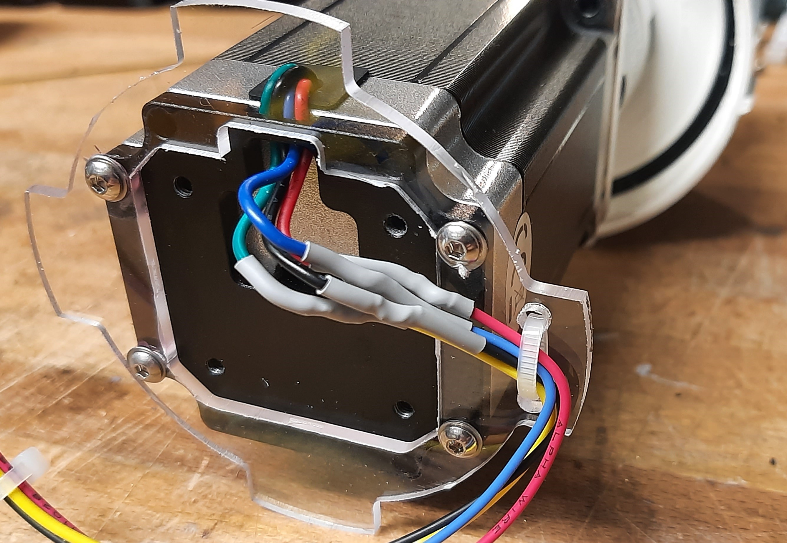
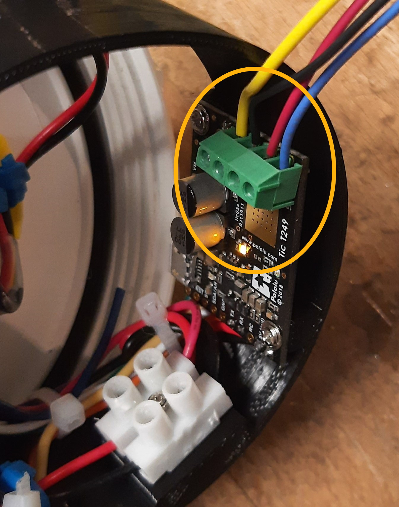
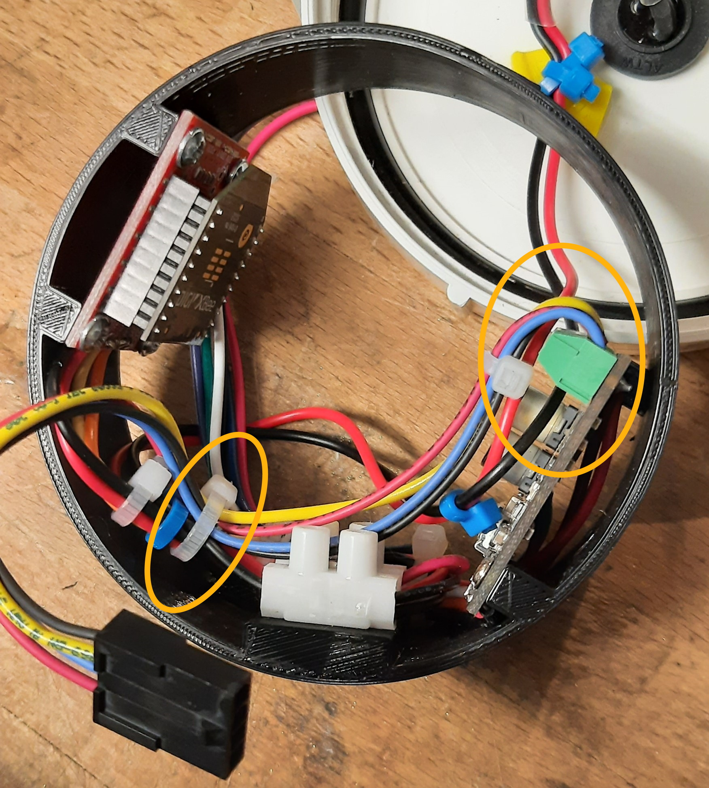
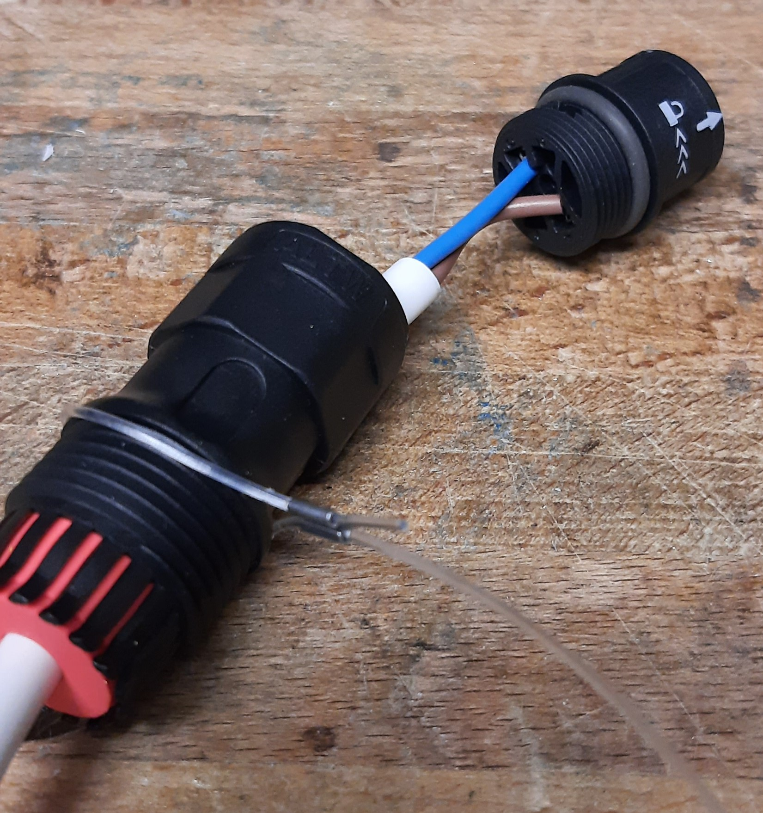
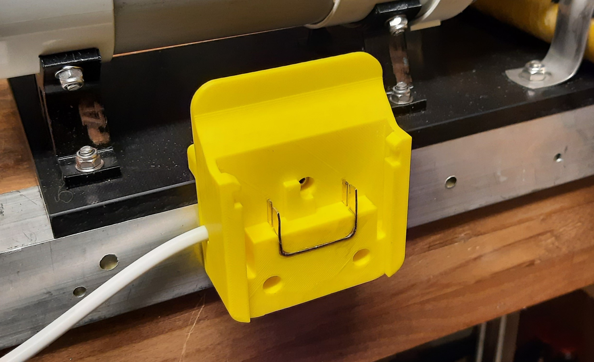
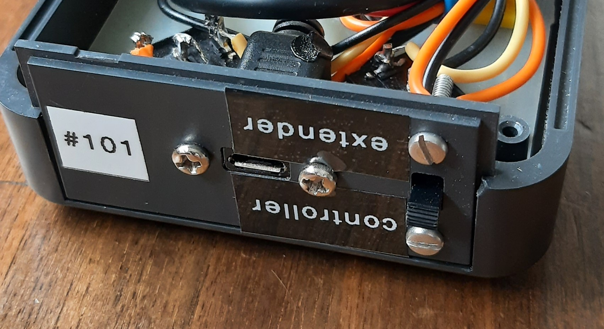
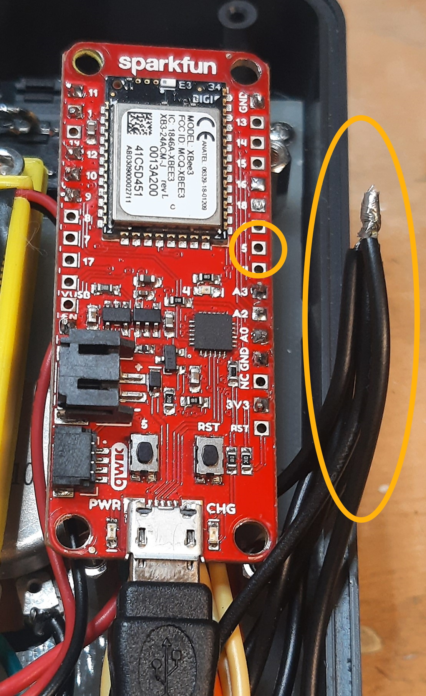
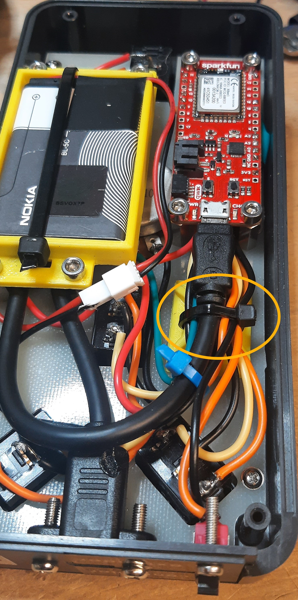

= Wireless echosounder winch upgrade instructions
:author: Aqualyd Limited
:email: gavin@aqualyd.nz
:revnumber: v1.0
:revdata: May 2022
:sectnums!:
:doctype: book
:toc:
:toclevels: 4
:xrefstyle: short
:imagesdir: ../.
:chapter-label:
:hide-uri-scheme:

[colophon]

(C) 2022 Aqualyd Limited, https://www.aqualyd.nz

This was document last built at {localdatetime} 

The latest vesion of this manual is available on https://github.com/gavinmacaulay/wireless-winches.git[github].

== Introduction

This document explains how to upgrade the Aqualyd Wireless Calibration winches. After the upgrade the power consumption will be reduced, the input voltage tolerance will be increased to 47 V, winch status reports will be available via an Android app, the hand controller can function as a range extender, and power supply via batteries will be enabled.

The upgrade process is somewhat involved and technical. Expect to take 30-60 minutes per winch to carry out the upgrade. The skills required are:

* Experience working with sensitive electronic components
* Ability to solder components and wiring on to printed circuit boards

=== Supplied items

These items are supplied as part of the upgrade kit:

. Sparkfun Xbee dongle + USB cable/mount
. Motor connector wiring (plug end) & heat-shrink sets (x6)
. Motor connector wiring (socket end) & 4-way PCB-mount screw terminals (x6)
. Replacement controller end plate and wiring (x2)
. Battery brackets & cables (x6)
. M4 x 16 mm socket head machine screws (x18)
. M4 taps (x2) and 3.4 mm drill bit
. Rubber for pole holder brackets (x12)
. Small cable ties

=== Items not supplied

Not supplied, but required for 2 battery-driven winch sets:

* Hikoki MultiVolt batteries x 6 (BSL36A18 or BSL36B18). 
* Hikoki MultiBolt battery charger x 2 (e.g., UC18YSL3)

Of the two recommended batteries, the BSL36B18 has the higher capacity (4Ah at 36V), but the smaller BSL36A18 (2.5Ah at 36V) would probably suffice. During tests with a 3.2 kg weight, the 4 Ah battery was discharged from 100% to 20% capacity after 20 hours with a stationary winch and in three hours when the winch was rotating at 0.2 m/s in a continuous raise/lower pattern. Battery life during a typical calibration is expected to be from 4 to 6 hours, but does depend on usage pattern, line tension, etc.

It is recommended to have a fourth battery per winch set so that a battery can always be charging. 

=== Tools needed

These tools are required to carry out the upgrade:

* Hex keys (2.5, 3, and 4 mm)
* Small Philips head (PH0) screwdriver, preferably with a long shaft
* Very small flat head screwdriver, preferrably with a long shaft
* Small adjustable spanner or thread tap handle
* Soldering iron, solder
* Heat gun
* Electric drill
* Small pliers/cutters
* Utility knife/box cutter
* Small G-clamp
* 10 mm ring spanner or small adjustable spanner
* Windows computer with USB port

=== Items to return to Aqualyd

Please return the listed items to:

[literal]
Gavin Macaulay
Aqualyd Limited
341 Higgins Road
Wakefield 7095
New Zealand

. Sparkfun Xbee Dongle (red circuit board with USB connector) +  USB cable/mount
. Removed winch motor driver & connecting cable (x6)
. Removed hand controller end plate (x2)
. Range extender (x2), which will be upgraded to hand controllers and returned to CSIRO
. M4 tap (x2) and 3.4 mm drill bit

== Upgrades

There are three hardware upgrade steps and two software upgrade steps. They can be carried out in any order, but the entire winch system will not function again until all steps have been carried out.

=== Change motor controller

The motor unit contains two motor controllers - one of these is no longer needed and will be removed. The remaining motor controller will then be connected directly to the motor.

Repeat the following for each winch unit:

. Unbolt the rod tube brackets and remove the yellow fibreglass tube
. Unscrew the power connector end of the winch unit endcap, pull out the electronics ring, then reach into the tube and unplug the wires that connect to the motor controller
. Unscrew the reel end of the winch endcap and gently pull the winch motor out of the tube
. Detach the four short wires that go from the motor to the attached motor controller
. Unscrew and remove the motor controller, leaving the clear plastic support in place
+
[.right]
.New motor wiring.
[[winch_wiring]]

+
. Drill two holes (use the 3.4 mm drill bit) in one of the side tabs on the clear plastic support - these are for a cable tie (see <<winch_wiring>>). 
. Take the supplied motor connector wiring (plug end) and solder onto the wires that come out of the motor. Match colours, except for green, which gets connected to yellow. Use the supplied heat shrink to protect the soldered joins
. Secure the wires using a cable tie through the two holes drilled in the clear plastic support (<<winch_wiring>>)
. Reinsert the motor and endcap back into the tube and tighten the endcap
. Remove the tic249 motor controller from the plastic electronics mounting ring
.. Cut off the old motor wiring/socket bundle as close to the circuit boards as practical (this connector and wiring is to be returned to Aqualyd)
.. Solder the supplied 4-way terminal block onto the tic249 PCB holes marked with A1,A2,B1, and B2
. Connect the motor connector wiring (socket end) to the newly installed terminal block. Follow the colour order shown in <<tic_wiring>>.
+
[.float-group]
--
[.left]
.Motor controller board wiring.
[[tic_wiring]]

[.left]
.Motor wires secured to existing wiring.
[[tic_wires_secured]]

--
+
. Reinstall the tic249 motor controller into the plastic electronics mounting ring and secure the new tic249 wires using a cable tie to the existing cable bundle in the electronics mounting ring (<<tic_wires_secured>>)
. Upgrade the software on the Xbee circuit board (do it at this stage while the winch unit is open) - see the <<_upgrade_winch_and_hand_controller_software>> section.
. Reconfigure the motor controller - see the <<_reconfigure_motor_controller>> section
. Connect the motor wiring plug and socket and reinsert the electronics mounting ring and endcap, taking care to ensure that when doing up the endcap that no wires are caught. It takes about two turns to tighen the endcap and pre-turning the endcap can help ensure the wires are not excessive twisted when the endcap is done up
. Ensure the endcap is very tightly screwed on
. Reinstall the yellow rod tube, adding a rubber sheet under each bracket (this prevents the yellow tubes from becoming loose during use)

=== Reconfigure motor controller

The remaining motor controller needs some reconfiguration to work without the removed motor controller and to reduce power consumption.

. Download and install the https://www.pololu.com/file/0J1325/pololu-tic-1.8.2-win.msi[Pololu Tic Control Center] software.
. Start the Pololu Tic software
. For each winch:
.. Connect a USB cable between the PC and the tic249 board in the winch
.. If not done automatically, choose the motor controller in the 'Connected to:' box
.. Change to the `Input and motor settings` tab and set the following (some will already be set correctly):
... `Enable command timeout` to 0.5 s
... `Max speed` to 154607660
... `Max acceleration` and `Min acceleration` to 3092153
... `Step mode` to 1/4 step
... `Current limit` to 2720 mA
... `AGC mode` to On
... `AGC Bottom current limit` to 45%
... `AGC current boost steps` to 5
... `AGC frequency limit` to Off
.. Disconnect the USB cable from the tic249 board.

=== Upgrade winch and hand controller software

The software in the motors is changed to actively reduce the power consumption of the motor when stationary, and to collate winch status information and send it to the hand controller. The hand controller software is enhanced to receive this winch status information and to send it out via Bluetooth.

. Download and install the https://www.digi.com/resources/documentation/digidocs/90001526/tasks/t_download_and_install_xctu.htm[Digi XCTU Xbee software] onto a computer
. Download the https://github.com/gavinmacaulay/wireless-winches/tree/main/code/winch[winch software] and https://github.com/gavinmacaulay/wireless-winches/blob/main/code/controller/main.py[controller software]. These both have the same name (`main.py`) and need to keep that name, so store them in different directories.
. Upgrade winch software (repeat for each winch):
.. Insert the supplied red Sparkfun board into the USB cable mount and connect the USB to the PC
.. Remove an Xbee circuit board from a winch - it will pull out of the socket on the underlying red PCB. Note the orientation of the Xbee board.
.. Insert the Xbee into the Sparkfun Xbee dongle
.. Connect to Xbee using XCTU
... Click on the 'Add devices' icon (top left of XCTU window), choose the appropriate USB serial port
... Click on the (only) Xbee listed in the left hand pane of the XCTU window
.. Open the File Manager (Tools:File System Manager) and click on the Open button
.. Copy the winch `main.py` file to the Xbee, replacing the existing main.py file
.. Click on the green 'Open' button to disconnect the file system manager
.. Re-insert Xbee into winch unit. noting the correct orientation.
. Upgrade Controller software (repeat for each controller):
.. Using a USB cable, connect the controller unit to a PC
.. Connect to the Xbee that is inside the controller using the XCTU software
.. Open the File Manager and copy the controller `main.py` file to the Xbee
.. Unplug the USB cable from the controller and ensure the controller power switch is in the off position

=== Add battery brackets to winch unit

This upgrade simply adds battery brackets to the winch units. These are easily removable as, without modification, the storage/transit case foam does not have cutouts to accomodate the battery brackets.

Repeat the following for each winch unit:

. Add the winch power connectors that were supplied as part of the original wireless winch system to the end of battery bracket cables (<<battery_connector>>). Brown wire is positive and goes to pin 1 in the connector.
. Clamp battery brackets to winch unit, centred between the legs of the winch tube (<<battery_bracket>>)
. Drill 3.4 mm diameter holes at the location of the three holes in the battery bracket. The hole into the plastic should be at least 13 mm deep.
. Tap all three holes using the M4 taps. In the aluminium tap all the way through. In the plastic, tap to at least 10 mm depth
. Secure the battery bracket to the winch unit using the included M4 machine screws

[.float-group]
--
[.left]
.Partially assembled battery connector.
[[battery_connector]]

[.left]
.Location of battery bracket.
[[battery_bracket]]

--

=== Add mode switch to hand controller

A separate switch is added to the hand controller to select between operating as a hand controller or a range extender.

Repeat for each hand controller:

. Remove the rubber case from the controller, remove the four screws, then remove the back half of the case
. Unscrew the two screws holding the USB connector on the case end plate and remove the end plate (this part is to be send back to Aqualyd)
+
[.right]
.Orientation of new end plate.
[[end_plate]]

+
. Attach the USB connector to the replacement end plate, ensuring that the slide switch on the end plate is on the right hand side when viewing the controller innards (<<end_plate>>)
. Insert the end plate into the controller case
. Unscrew the red Sparkfun circuit board and solder the orange wire from the slide switch into the hole marked 5 (on the right hand side). Take care to bring the wire in from underneath the circuit board in the same way that other wires are attached.
. Remove the heatshrink from the bundle of black wires that were under the Sparkfun board and add and solder the black wire from the slide switch (<<controller_wiring_black>>)
. Use the supplied black heat shrink to protect the newly soldered join
. Reinstall the red circuit board, tucking the new wires securely under the Sparkfun board
. Secure the slide switch wires using the supplied cable tie (best to remove the existing cable tie and add the new wires to the bundle of other wires) (<<controller_wiring_done>>)
. Reassemble the winch controller case and rubber case

[.float-group]
--
[.left]
.Slide switch connections.
[[controller_wiring_black]]

[.left]
.Slide switch wire securing.
[[controller_wiring_done]]

--

== Testing
After performing the upgrades, the winches can be powered by Hikoki MultiVolt batteries and status information about the winches (line out, line speed, battery voltage, and internal temperature) can be displayed on an Android app.

The Android app will be supplied separately (it's not yet ready).

For each winch: 

. Insert a fully charged battery into a holder and measure the voltage of the cable connector. It should be somewhere between 40 and 42 V. The positive voltage must be on pin  1 - if not, the wiring in the connector should be reversed
. Connect the battery cable to the winch. The winch will probably make a thunk sound and the winch drum will no longer be able to be rotated by hand
. Turn on the hand controller, check that the mode switch is set to `controller`, then operate the relevant switch to make the winch rotate. Test changing the speed.

To test the display of winch status:

. Insert a battery into at least one winch,
. Turn on the hand controller,
. Install and start the Android app and connect to the hand controller.

Winch stats should be shown on the screen for all powered on winches and should update about every 0.5 s.

